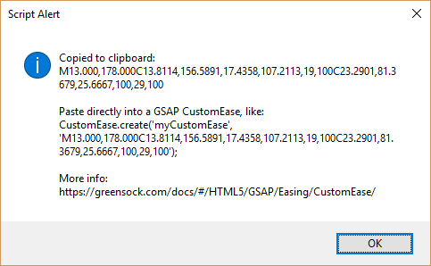

# ae-ease-to-gsap-customease 

## Motivation
Ever wished you could take your ease curve from the graph editor in After Effects and somehow use it directly
in your [GSAP](https://greensock.com/gsap) animation? Now you can.

## Installation
1. [Click here](https://github.com/SupportClass/ae-ease-to-gsap-customease/raw/master/ae-ease-to-gsap-customease.js)
to download `ae-ease-to-gsap-customease.jsx`, and save it to a place where you can find it again easily.

## Usage
1. Open your After Effects project.
2. Select the layer whose ease curve you wish to export.
3. Select the property (such as Scale, Opacity, etc) whose ease curve you wish to export.
4. Go to "File > Scripts > Run Script File..."
5. Browser to where you downloaded `ae-ease-to-gsap-customease.jsx` and select it, then click "Open".
6. If the script ran successfully, you will see an alert like this:
	
	
7. You can now paste the contents of your clipboard directly into a [GSAP CustomEase](https://greensock.com/docs/#/HTML5/GSAP/Easing/CustomEase/).

To preview your ease, you can paste it into GreenSock's "[Ease Visualizer](https://greensock.com/docs/#/HTML5/GSAP/Easing/CustomEase/)" tool.

## Thanks
In writing this script, I studied code from 
- @turbodrive ([Source](https://gist.github.com/turbodrive/a0913ac83e3d5d5f5b15))
- @juancabrera ([Source](https://gist.github.com/juancabrera/026fb883cb2bae93bd21))
- @bodymovin ([Source](https://github.com/bodymovin/bodymovin))

I also received guidance from @zlovatt, who made time to answer my beginner questions.
